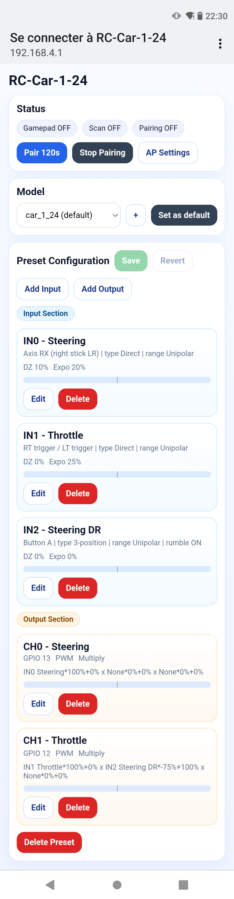
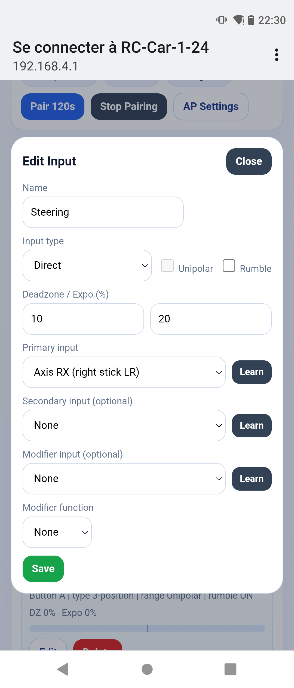
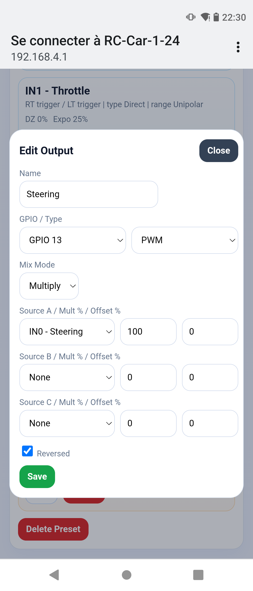
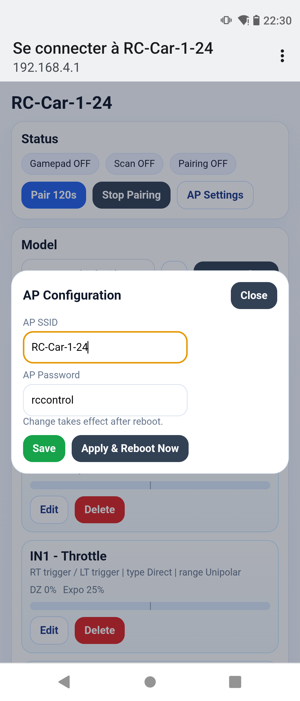

# RC Controller (ESP32 + Bluepad32 + Web UI)

Web-configurable RC transmitter/mapper running on ESP32 boards.

This project uses:
- **ESP-IDF 5.4.2** (via PlatformIO)
- **Arduino as ESP-IDF component**
- **Bluepad32** for Bluetooth gamepad support
- **ESP32Servo** for PWM outputs

Main target currently used in development: **ESP32-S3-DevKitC-1**  
Planned/expected compatibility: **ESP32-WROOM-32** (including DualShock 4 over Bluetooth Classic).

## Features

- Wi-Fi AP + captive portal web interface
- Bluetooth gamepad pairing/scan controls
- Input editor:
  - Direct / 2-position / 3-position input types
  - Unipolar / Bipolar toggle range
  - Optional modifier function (Reverse / Center)
  - Optional gamepad rumble feedback
- Output editor:
  - PWM / ON-OFF outputs
  - 3-source mix (`A/B/C`) with multiplier + offset
  - Mix mode: `Add` or `Multiply`
- Presets (models):
  - Built-in readonly presets: `car`, `excavator`, `skid_steer`
  - Custom presets: create, edit, save, revert, delete
  - Boot default preset selection
- AP configuration from UI:
  - AP SSID
  - AP password
  - Save for next boot, or **Apply & Reboot Now**

## Documentation

- User guide: [docs/USER_GUIDE.md](docs/USER_GUIDE.md)
- Flashing guide (minimal tools): [docs/FLASHING.md](docs/FLASHING.md)
- Web installer page template: [docs/install.html](docs/install.html)

## Nightly Releases (GitHub Actions)

Nightlies are built by workflow: `.github/workflows/nightly-release.yml`.

How to trigger manually:
1. Open GitHub `Actions` tab.
2. Select `Nightly Release`.
3. Click `Run workflow`.

Release bundles are currently generated for:
- `esp32dev`
- `esp32-s3-devkitc-1`

Experimental compile-only CI targets (no release bundle yet):
- `esp32-c3-devkitc-02`
- `esp32-c6-devkitc-1`

Generated release assets include, for each release-ready board:
- `rc-controller-<env>-bootloader.bin`
- `rc-controller-<env>-partitions.bin`
- `rc-controller-<env>-firmware.bin`
- `rc-controller-<env>-spiffs.bin`
- `manifest-<env>.json`

## UI Screenshots

<a href="docs/images/ui-overview.png"></a>
<a href="docs/images/ui-edit-input.png"></a>
<a href="docs/images/ui-edit-output.png"></a>
<a href="docs/images/ui-ap-settings.png"></a>

For step-by-step screenshots in context, see the [User Guide](docs/USER_GUIDE.md).

Repository structure (quick):
- `main/sketch.cpp`: top-level orchestration (setup/loop, AP/BT init, endpoint handlers)
- `main/web_routes.*`: centralized HTTP route registration
- `main/state_service.*`: JSON payload builders for `/api/state`, `/api/activity`, `/api/inputs`
- `main/json_utils.*`: lightweight JSON writer + shared escaping
- `main/runtime_loop.*`: control tick (gamepad data, failsafe behavior)
- `main/preset_service.*`: user preset helpers (save/name collision handling)
- `main/control_inputs.*`: gamepad input definitions + normalization + learn detection
- `main/rc_model.*`: virtual input/output runtime model and signal processing
- `main/preset_store.*`: preset/NVS low-level persistence
- `main/web_ui.*`: filesystem mount + `index.html` streaming
- `data/index.html`: frontend UI asset served from SPIFFS
- `components/`: third-party components (e.g. ESP32Servo)
- `patches/`: local component patches

## Build and flash (PlatformIO)

```powershell
# Build (ESP32-S3)
pio run -e esp32-s3-devkitc-1

# Upload
pio run -e esp32-s3-devkitc-1 -t upload

# Upload UI filesystem image (required after frontend changes)
pio run -e esp32-s3-devkitc-1 -t uploadfs

# Serial monitor
pio device monitor -p COM8 -b 115200
```

If `pio` is not in your PATH on Windows, use:

```powershell
& "$env:USERPROFILE\.platformio\penv\Scripts\pio.exe" run -e esp32-s3-devkitc-1
```

## Notes

- Some boards report flash-size mismatch warnings in PlatformIO if board config and physical flash differ.
- Current AP/channel coexistence behavior is tuned for development and may still need per-board tuning.
- `car` and `excavator` are intentionally readonly baseline presets.
- The UI is now loaded from SPIFFS (`data/index.html`), so flashing filesystem image is required.

## AI-assisted development

This project is developed primarily with AI assistance (architecture, implementation, refactors, and UI iterations), with human review and iterative validation on hardware.

## Roadmap (short)

- Continue code split from `sketch.cpp` into dedicated modules
- Improve AP + BT coexistence across more ESP32 variants
- Preset import/export
- Better gamepad profile abstraction (labeling/layout per controller family)

## License

See [LICENSE](LICENSE).
